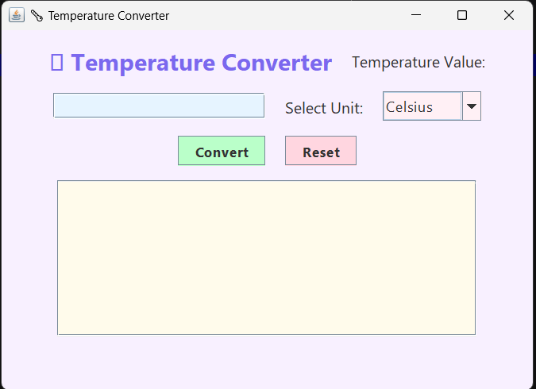
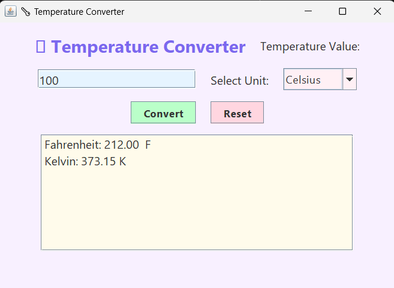

# Temperature Converter GUI

## Task 01 - Temperature Converter

This project is a Java Swing-based Temperature Converter that allows users to convert temperature values between Celsius, Fahrenheit, and Kelvin scales through an interactive graphical user interface.

### Features
- Convert Celsius to Fahrenheit and Kelvin
- Convert Fahrenheit to Celsius and Kelvin
- Convert Kelvin to Celsius and Fahrenheit
- User-friendly GUI
- Input validation
- Reset functionality
- Kelvin range validation

## How to Run

### Compile
```bash
javac TemperatureConverterGUI.java
```

### Execute
```bash
java TemperatureConverterGUI
```

## Example

### Input
```
Temperature Value: 100
Unit: Celsius
```

### Output
```
Fahrenheit: 212.00 F
Kelvin: 373.15 K
```

## Screenshots
### Main Interface


### Conversion Result


## Technologies Used
- Java
- Java Swing

## Concepts Learned
- GUI Development using Swing
- Event Handling
- User Input Validation
- Temperature Conversion Logic
- Object-Oriented Programming

## Author
Manpreet Kaur

Software Development Intern @ SkillCraft Technology
